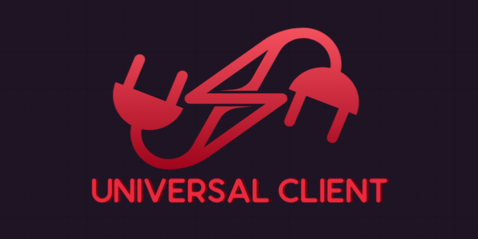

#  Universal-Client

**A TypeScript‑first, plugin‑driven library for seamless, configuration‑driven communication with multi-protocol services — optimized for modern service architectures and high‑performance apps.**



---

## 🚀 Why universal-client? 

Tired of writing separate glue code for HTTP, gRPC, Kafka, and Socket.IO? Want a **single, typed, persistent, and zero‑boilerplate way** to invoke **any service** from **any node** in your network (client, server, microservice, event handler, etc.)?  
**universal-client** delivers exactly that.

- **Direct and unified API:** No need to spin up a separate proxy, API gateway, or BFF.
- **Low latency:** Uses pooled, persistent gRPC and Socket.IO connections.
- **TypeScript-first:** Typed interfaces and generic results for backend, frontend, and service-to-service calls.
- **Configurable & Extensible:** Map endpoints to protocols, routes, and remote methods via simple config.
- **All-in-one:** HTTP(S), gRPC, Socket.IO—use any, all, anytime, anywhere.
- **Production-ready:** Focus on business logic, never on protocol friction, reliability, or connection churn.

---

## ✨ Features

- 🔌 **Multi-Server:** gRPC, HTTP(S), Socket.IO support (add more easily\*)
- 🏎️ **Persistent**: Pools gRPC & Socket clients for speed and resource efficiency.
- 🧩 **Pluggable/Configurable:** All endpoint definitions are in JSON or JS config. Novice-friendly!
- 🛡️ **Strong Typing:** Types/interfaces for all calls, working across browser and backend.
- ⏱️ **Optimized Latency:** Built-in timeouts, connection reuse, minimal setup per call.
- ♾️ **Universal Use:** Works from Node.js, Express, gRPC servers/clients, Socket servers, React/Next.js (web).
- ◀️ **Bi-directional:** Every server can also be a client—microservices nirvana.
- 🚦 **Error Handling:** Standardized, evented, and debuggable.
- 📚 **Easy Extendability:** Add more protocols or custom transports as needed.
- 🚀 **Unified API** for multiple protocols — one `.call()` for all.
-    **Production ready** — in microservices, APIs, frontends, or edge runtimes.
- ⏱  **Timeout control** per call or globally
- 📦 **Streaming** support (gRPC streaming, Kafka consumers, Socket.IO event streams)

## ✨ Supported Protocols

✅ HTTP / HTTPS  
✅ gRPC (`@grpc/grpc-js`) native  
✅ **gRPC-Web** (`grpc-web` for browser/client-side use)  
✅ Socket.IO (with connection wait + event handlers)  
✅ Plain WebSocket  
✅ Kafka (Producer & Consumer with pause/resume)  
✅ NATS, AMQP, MQTT (community plugins)  
✅ Easily extensible via `ServerTypeClient` interface

---

## 🔥 How is this different from ordinary API clients or SDKs?

- **No API gateway or full BFF required:** Communicate _directly and programmatically_ with any protocol—no middleware layer, no DSL parsing.
- **Multi-protocol out of the box:** HTTP, gRPC, Socket.IO, all are first-class.
- **Configuration, not code:** Change protocol/server mappings instantly—no redeploy.
- **Strong, static typing:** Share interfaces with backend and frontend—no more `any`s or manual axios calls.
- **Persistent**: gRPC and Socket.IO connections are reused, not reopened every call.
- **Easy to embed**: Use just like any DB driver or HTTP lib, but works with every protocol you care about.
- **Ideal for...** microservices, modern SaaS, DDD, cloud-native, and “polyglot” architectures.

---

## ⚡️ Example Use Cases

- **React UI making real-time and HTTP calls through a unified method**
- **Express middleware service exchanging data with both gRPC and HTTP services**
- **A gRPC server acting as a client to HTTP and Socket.IO backends**
- **Chat server sending analytics events to REST microservices**

---

## 📦 Installation

```bash
    npm install @ananay-nag/universal-client
    or
    yarn add @ananay-nag/universal-client
```

---

## 🛠️ Quick Start

### 1. Define your endpoints and protocols

```typescript
import { UniversalClient, UniversalClientConfig } from "@ananay-nag/universal-client";


const config: UniversalClientConfig = {
  endpoints: {
    // gRPC native
    createUser: {
      serverType: SupportedServerTypes.GRPC,
      host: "localhost",
      port: 50051,
      protoFile: "./protos/user.proto",
      packageName: "user",
      serviceName: "UserService",
      methodName: "CreateUser",
    },
    // gRPC-Web (browser friendly)
    sayHelloWeb: {
      serverType: SupportedServerTypes.GRPCWEB,
      host: "http://localhost:8080",
      serviceName: "GreeterService",
      methodName: "sayHello",
      createClient: (address: string) => new GreeterServiceClient(address),
      options: {  
        timeoutMs: 10000
      },
    },
    // HTTP
    signup: {
      serverType: SupportedServerTypes.HTTP,
      host: "http://localhost:4000",
      path: "/api/signup",
      methodName: "POST",
    },
    // Socket.IO with event handler for server pushes
    receiveEmits: {
      serverType: SupportedServerTypes.SOCKETIO,
      host: "http://localhost:3002",
      port: 3002,
      eventHandler: (socket: Socket) => {
        socket.on("serverEvent", console.log);
      },
    },
    sendChat: {
      protocol: SupportedServerTypes.SOCKETIO,
      host: "http://localhost",
      port: 3001,
      event: "sendChat",
    },
    // Kafka Producer
    kafkaProducer: {
      serverType: SupportedServerTypes.KAFKA,
      host: "localhost:9092",
      topic: "chat",
      mode: "producer"
      options: {},
    },
    // Kafka Consumer
    kafkaConsumer: {
      serverType: SupportedServerTypes.KAFKA,
      host: "localhost:9092",
      groupId: "chat-group",
      topic: "chat",
      mode: "consumer",
      options: {
        fromBeginning: true,
      },
      messageHandler: async ({ topic, partition, message }: any) => {
        console.log(`${topic} [${partition}]: ${message.value.toString()}`);
      },
    },
  },
};

const client = new UniversalClient(config);
```

### 2. Create and use your client anywhere

```typescript
// gRPC native call
await client.call("createUser", { username: "alice", email: "test@example.com" });

// gRPC-Web call
await client.call("sayHelloWeb", new HelloRequest().setName("World"));

// HTTP POST
await client.call("signup", { username: "bob", password: "secure" });

// Socket.IO emit
await client.call("sendChat", { message: "Hello real-time!" });

// Kafka produce
await client.call("kafkaProducer", { userId: 1, message: "Hi Kafka" });

// Kafka control (pause consumer)
await client.call("kafkaConsumer", null, { methodName: "pause" });

```

---

## ⚙️ Middleware (Auth Example)

```typescript
import { AuthJwtPlugin } from "@ananay-nag/universal-client";

function getToken() {
  return localStorage.getItem("jwtToken") || "";
}

client.useMiddleware(AuthJwtPlugin(getToken));
```

---

## 🏗️ Examples

### a) In a gRPC server (service-to-service communication):

```RPC
// gRPC handler
async function CreateUser(call, callback) {
// Notify chat via Socket.IO and signup via HTTP/S
await universalClient.call('sendChat', { message: ${call.request.username} signed up! });
await universalClient.call('signup', { ...call.request, password: 'auto-gen' });
// Respond as normal
callback(null, { id: '42', ...call.request });
}
```

### b) In a Socket.IO server:

```typescript
io.on("connection", (socket) => {
  socket.on("register", async (payload, cb) => {
    const user = await universalClient.call("createUser", payload); // gRPC call
    cb({ user });
  });
});
```

### c) In an Express API:

```typescript
app.post('/user', async (req, res) => {
  const user = await universalClient.call('createUser', req.body); // gRPC
  await universalClient.call('sendChat', { message: New user: ${user.username} }); // Socket
  res.json(user);
});
```

---

## 🤖 TypeScript Typings

You can define your own interfaces for request/response types—and use codegen from `.proto` files for _full type safety_.

---

## ⚙️ Advanced Config

- **Timeouts:**  
  Pass optional `{ timeoutMs: 5000 }` as the third argument to `.call()` for custom timeouts.

- **Extending protocols:**  
  PRs welcome! Add NATS, MQTT, Rabbit, or custom protocols by simply dropping in a new client module.

---

## Works with HTTP headers, gRPC metadata, Socket.IO auth handshake.

---

## ⚡ Socket.IO Updates

- **`createClient` now waits** for connection before returning, avoiding "not connected" errors.
- **`eventHandler` in config** lets you subscribe to server-emitted events once on connect.

---

## 📌 gRPC-Web Notes

- For browsers/environments without raw gRPC, provide `createClient` in config that returns your generated grpc-web client.
- Official `grpc-web` npm package supported.

---

## 🎯 Kafka Updates

- Unified `kafkaPlugin` supports producer/consumer via `options.mode`.
- Delegates send/control logic to `kafkaProducerPlugin` / `kafkaConsumerPlugin`.
- Consumers can auto-run `messageHandler` for incoming messages.

---

## 🤖 TypeScript

Types are exported for:
- `UniversalClientConfig`
- `EndpointConfig`
- `SupportedServerTypes`
- `CallContext`
- `MiddlewarePlugin` 

## 💡 Tips & Best Practices

- Share domain model types with backends (using a `@yourorg/protos` npm package).
- Use a config per environment (dev, staging, prod).
- For browser-based gRPC, use `grpc-web`\*; for Node, `@grpc/grpc-js` is native.
- Works in Monorepo or Polyrepo architectures.

---

## 🖥️ API

### UniversalClient

- `constructor(config: UniversalClientConfig)`
- `call<T>(key: string, payload: any, options: UniversalClientCallOptions = {}): Promise<T>`

---

## 🤩 Ready to Modernize Your Service Calls?

**Stop copying boilerplate and juggling SDKs. Power your microservices, apps, and cross-stack comms the _intelligent_, _clean_, and _typed_ way.**

---

## 📄 License

MIT

---

## 🌟 Contributing/Feedback

We welcome PRs and issues! If there's a protocol or feature you'd like, open a discussion on GitHub.
